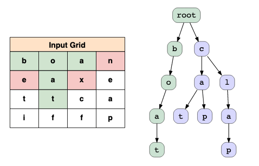
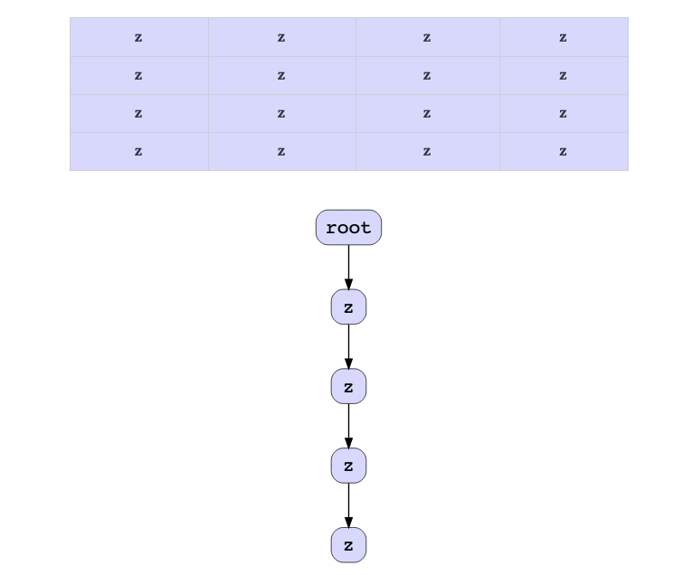

# Grid Search

## Description

Given a grid of characters and a list of strings words, return all the words present in the grid. While searching the grid, you can move to adjacent cells in four directions: up, down, left, and right. The same cell cannot be used more than once in the same word.

## Algorithms

- Step 1: Insert input words in a trie

Construct a trie with the words given in the input list.

- Step 2: Explore recursively

Iterate over all the cells of the grid and call a recursive function starting from the cell to find the word. From each cell, start the backtracking exploration and check if there exists any word in the dictionary that starts with the letter in the cell.

During the recursive function call, explore the neighbor cells (up, down, left, and right) around the current cell for the next recursive call. At each call, check if the sequence of letters that we've traversed so far matches any word in the dictionary by using the isEndOfWord flag in the trie.

During the recursive call, if the character of the current cell doesn't have a valid path in the trie prefix so far, stop the recursive call and backtrack.

One important point to note here is we can't use the same cell more than once in a single word. To achieve this we can use a boolean value for visited array for each recursive call so we don't call the same cell again in our DFS calls for the current word.

### Complexity

The variables are:

- Number of cells in the grid = C.
- Number of words in the list = N.
- The average length of given words in the input list and the query list = W

#### Time complexity:

- Insertion of a word in the trie: O(W).
- Inserting N words in the trie: O(N*W)
- Traversing trie to find a word in the grid using DFS: O(4 * C * 3^W)
- Traversing trie to find NN words in the grid using DFS: O(4 * N * C* 3^W)

For recursively traversing the grid, we calculate an upper bound of steps for the worst-case scenario for this problem. The algorithm loops over all the cells in the board; therefore, we have C as a factor in the complexity formula. It then boils down to the maximum number of steps needed for each starting cell. Assume the maximum length of the word is W, starting from a cell initially, we'd have at most 4 directions to explore. Assuming the worst case in which each direction is valid, we would have at most 3 neighbor cells (i.e., excluding the cell where we come from) to explore during the following exploration. There are four directions to explore for the first letter, but there are only three directions to explore for the remaining letters of the word. As a result, we would traverse at most 4×3(W−1) cells during the backtracking exploration. Since this exploration is performed for all the N input words, the time complexity becomes O(N×C×4×3(W−1))≈O(N×C×4×3W).

#### Space complexity:

- Insertion of a word in the trie: O(W).
- Inserting N words in the trie: O(N*W + C)

In the worst case, all the letters of all the words can be different. This implies that there will be no common prefixes; hence, new trie nodes will be created for all the letters of the word. Therefore, the space consumed will be proportional to the word length—that is, O(W). Since this operation is performed for all the N input words, the total space complexity becomes O(N*W). 

We also create a visited array, which is the same size as the grid. The space is O(C), which is the number of cells in the grid.

Combining the complexity of the two steps, the final space complexity is O(N*W+C).

> The above time complexity is estimated under the assumption that the trie data structure would not change once built. If we apply the optimization trick to gradually remove the nodes from the trie after a successful match, we could greatly improve the time complexity since the cost of backtracking would be reduced to zero once we match all the words in the dictionary (i.e., the trie becomes empty). 

##### Worst-case example

Here's an example of the worst-case scenario. Imagine each of the cells on the board contains the letter z, and the word dictionary contains a single word ["zzz"]. 

