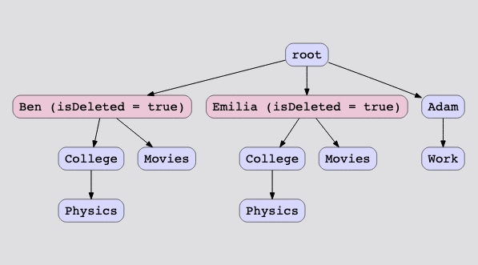

# Grid Search

## Description

A new file system doesn't allow duplicate directory structures. Two directories are said to have similar structures if they contain the same set of identical directories.

The file system has a duplicate checker that regularly identifies the directories with similar structures and marks them for deletion in the next cycle. The file system only runs the deletion once, so any folder that becomes identical after the initial deletion is not deleted.

Return the 2D array containing the paths of the remaining folders after deleting all the marked folders.

## Algorithms

- Step 1: Insert the directories in a trie

Construct a trie with the directories given in the input list.

- Step 2: Find directories with similar structure

Create a deduplication mechanism. Traverse the trie in post-order fashion. Convert the directory structures to strings and store them in a hashmap. If a string already exists in the hashmap as the key, it implies that a similar subdirectory structure already exists in the file system. The hashmap stores the directory structure string as the key and the pointer to the trie node as the value. This information is used for marking the directories that have been deleted in the trie.

- Step 3: Fetch the remaining directories

In the end, traverse the entire trie again to gather the directories which are not marked as deleted, add them to the output, and return the output.

### Complexity

The variables are:

- Number of directory paths in the input = N.
- The average length of directory path in the file system = the number of folders in the directory path = F.

#### Time complexity:

- Inserting a directory path in the trie: O(F).
- Inserting all input directory paths in the trie: O(N*F)
- Traversing the trie to perform deduplication: O(N*F)
- Traversing the trie to collect remaining directories: O(N*F)

#### Space complexity:

- Inserting a directory path in the trie: O(F).
- Inserting all input directory paths in the trie: O(N*F)
- Traversing the trie to perform deduplication: O(N*F)
- Traversing the trie to collect remaining directories: O(1)

We traverse the trie in a depth-first search fashion and add the directory paths to the output. DFS is a recursive algorithm and consumes stack space. In the worst case, the stack space consumed can be equivalent to the number of nodes in the trie, which is N×F. 