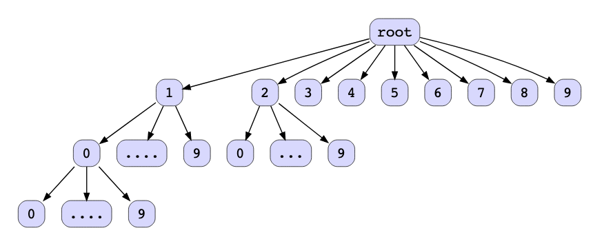
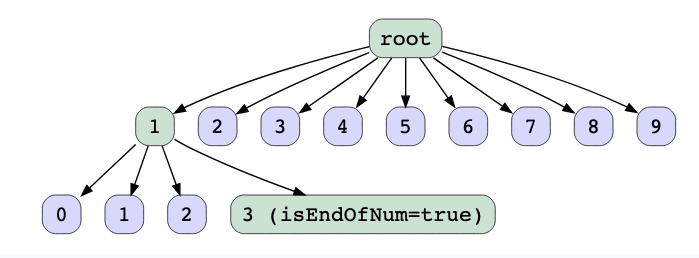

# Sorted Numbers

## Description

Given an integer num, return all the numbers in the range [1,num] sorted in lexicographical order.

## Solution

The first idea that strikes the mind is to iterate through all the integers from 1 to num, convert them into strings, insert them into a list, and then sort them. Considering the use of a standard sorting algorithm like merge sort, this approach has a time complexity of O(NlogN) and space complexity of O(N), where N is the number of integers in the range 1 to N.

Analyzing this problem closely, we can observe that all the numbers starting with 1 would precede the numbers beginning with 2 and so on. This provides us with the idea that we need to process the numbers beginning with 1 first and then similarly move on to the following integers.

Another observation here is the integers that begin with 11 are infinite, like 1,10,100,…11,110,…,12,…. The integer num acts as the upper limit here and provides guidance on when to stop the process of adding new values to the answers and to move on to explore the integers starting with the next digit.

We can observe that integers with common prefixes are placed next to each other in the sorted list. Inserting all the integers in the trie and traversing it in preorder fashion to collect the integers will lead to a sorted list of integers. The illustration below represents the trie of integers.

Using backtracking to traverse the trie adds additional memory requirements due to the stack space occupied during recursion. We can further optimize our approach by resorting to an iterative procedure instead. The state of the trie after the insertion of all the integers from 1 to num can be represented by the diagram below. Also, whenever we insert any new integer, we make sure to set a parameter isEndOfNum = true for the last node of that integer. This helps us identify whenever we have explored a new integer completely. This is similar to what we have done in previous lessons regarding strings to segregate prefixes from complete words.

After insertion, we traverse the tree in a preorder fashion using DFS and add all the valid integers in the final result list or vector.

### Algorithm

- Step 1: Insert the integers into a trie

Iterate through integers from 1 to num. Convert them to string and insert them into the trie.

- Step 2: Recursively traverse the trie

Beginning from the trie's root, recursively traverse the trie in a preorder fashion. A preorder traversal in case of tries implies that we visit the root node first, followed by the child nodes. It's called a preorder traversal because the root node is always visited before any of its child nodes.

Let's consider the given example where num=13. We begin with 1, then we add 10, which is smaller than 13. Next, we get 100, which is greater than 13, so we backtrack to 10 and move to the next sibling, 11, which is less than 13 and is added to the output. To summarize, whenever we encounter an integer that exceeds the upper limit num, we backtrack to the parent, increment that integer by one, and explore the next branch.

After understanding these details, it's clear that there are ten possible next values from every integer—that is, digits from 0 to 9. Essentially, we can visualize this as a trie of integers, with each node having children from 0 to 9. We explore this trie in preorder fashion using DFS, adding all the valid integers to the list, backtracking, and exploring the next branches whenever we encounter an integer higher than num.

### Complexity

The variables are:
 
- Number of unique words in the input = N.
- The average number of digits in the integers of the input list = D.

#### Time complexity:

- Inserting an integer in the trie: O(N).
- Inserting N integers in the trie: O(D)
- Traversing trie in preorder fashion using DFS: O(N * D)

#### Space complexity:

- Inserting an integer in the trie: O(W).
- Inserting N integers in the trie: O(N * D)

In the worst case, all the digits of all the integers can be different. This implies that there will be no common prefixes; hence, new trie nodes will be created for all the integer digits. The number of digits in an integer has an upper limit of D. Therefore, the space consumed is proportional to the number of digits—that is, O(D). Since this operation is performed for all the N integers, the total space complexity becomes O(ND). 