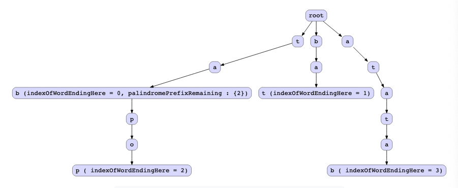

# Palindromes Pairs

## Description

Given an array words of unique strings, return an array of index pairs (i,j) such that arr[i]+arr[j] is a palindrome.

## Solution

Let's say that a palindrome is formed from three strings X, Y, and Z.

String P=X+Y+Z, where Z is the reverse of X and Y is a palindrome in itself.

For example:

XX == "abc"
YY == "aba"
ZZ == "cba"

String P=X+Y+Z == "abcabacba", which is a palindrome.

But from the problem statement above, it's clear that we have to find two strings that when concatenated form a palindrome. So, we have to modify the logic of P=X+Y+Z a little bit to find valid palindrome pairs.

Below we've tried to explore the cases in which two concatenated strings form a palindrome.

- Case 1

The simplest way to create a palindrome is to take two words that are the reverse of each other and put them together. In this case, we get two different palindromes, as we can put either word first. Two words that are the reverse of each other can form two unique palindromes because the words are different.

```
P = X+Y+Z
Note: Z is reverse(X) and X is reverse(Z) and Y is an empty string

For example, 
X = "bat"
Z = "tab"
Y = ""
"bat" + "tab" = "battab"
"tab" + "bat" = "tabbat"
```

- Case 2

Another way words can form a palindrome is demonstrated below:

```
P = X+Y+Z
String 1 = X+Y
String 2 = Z
Note: Y is a palindrome in this case and Z is equal to reverse(X)

For example,
X = "abc" 
Y = "aba" 
Z = "cba"
String P = X+Y+Z = "abcabacba", which is a palindrome.
String 1 = "abcaba"
String 2 = "cba"
```

- Case 3

Another way words can form a palindrome is demonstrated below:

```
P = X+Y+Z
String 1 = X
String 2 = Y+Z
Note : Y is a palindrome in this case , and X is equal to reverse(Z)

For example,
X = "abc" 
Y = "aba" 
Z = "cba"
String P = X+Y+Z = "abcabacba", which is a palindrome.
String 1 = "abc"
String 2 = "abacba"
```

Based on our familiarity with the trie data structure, we can investigate if there's a way to solve this problem using tries. First, we want to build a trie with the given words and then identify all the words from the trie that our current word would form a palindrome pair with.

Based on the intuition that we built previously, we want to find words in the trie that fulfill any of the following cases.

- Case 1: The word is the reverse of the current word.
- Case 2: The word in the trie starts with the reverse of our current word followed by a palindrome.
- Case 3: The word in the trie is the reverse of the first part of our current word, and the leftover of the current word forms a palindrome.

Since the words can share common prefixes, we try storing the information about the word ending in the trie node using an integer parameter indexOfWordEndingHere, which contains the index of the word that ends at the current node. Let’s refer to it as the word-ending index.

While inserting a word in the trie, we also try to identify if the remaining part of the current word is a palindrome. If that's true, we also store this information in the trie. This information will help us tackle "Case 2" and "Case 3." So, we maintain an integer array palindromePrefixRemaining, which holds the indexes of all the words whose later part forms a palindrome.

### Algorithm

- Step 1: Build a trie and insert reversed words

Initialize a trie and insert reversed words into it. We insert reversed words into a trie so we don't have to reverse every substring later while checking for palindromes.

- Step 2: Traverse the words and find palindrome pairs

Iterate through the words array and find the pair for each word using the three possible cases described below.

Let's try to understand these cases with the help of an example. The diagram below represents the trie created after inserting all the words in the trie in reverse order.

words: ["bat", "tab", "popbat", "batata"]



Case 1

A palindrome pair is formed by two words that are the reverse of each other.

Let's look at the first word of the input, bat, and find the pair for this word in the trie. Since words are inserted in the trie in reverse order, we can directly search for the word bat in the trie.

It's visible from the diagram below that upon traversing the trie, we can find the word in the trie. This essentially means we have found the word, which was originally tab, and the last node in the path indicates that the index of this word in the input array is 11.

Since the words in the input array are unique, we have found two possible unique palindromes, “bat+tab” and “tab+bat.” Hence, both (0,1)(0,1) and (1,0)(1,0) form valid pairs and are appended to the final output list.


Case 2

In this case, the first part of a word is found in the trie and the later part that remains in the trie should form a palindrome.

Let's look at the second word of the input array, which is tab. It's visible from the figure below that the word tab was found in the trie. Also, the remaining part of the word in the trie pop is a palindrome.


As discussed previously, our custom trie node stores the information about the word index in an integer array palindromePrefixRemaining. This array provides us the information about the word index, which is 2.

So, we can see that tab and the original word popbat form a valid palindrome, tabpopbat, and (1,2) form a valid pair and are added to the final result.

Case 3

In this case, the first part of a word is found completely in the trie, and the later part of the current word forms a palindrome.

Let's look at the second word of the input array, which is batata. It's visible from the figure below that the word bat is found in the trie. Also, the remaining part of the current word ata is a palindrome.


The custom trie node stores the information about the index of the word, which ends at node t, which is index 1.

So we can see that batata and the original word tab form a valid palindrome batatatab, and the indexes (3,1) form a valid pair and are added to the final result.

### Complexity

The variables are:
 
- Number of unique words in the input = N.
- The average number of digits in the integers of the input list = D.

#### Time complexity:

- Inserting a word in the trie and checking if the remaining string is a palindrome: O(W^2).
- Inserting N words in the trie: O(N * W^2)
- Finding palindrome pairs in the trie: O(N * W^2)

Creation of a trie: Inserting each word into the trie takes O(W) time. While inserting the word, at every step, we check whether the remaining word is a palindrome. In the worst case, we need to check the entire string for being a palindrome, so the time complexity of this step is O(W). This step is done W times for each word of size W, so the total time complexity of inserting a word in the trie is O(W^2). Since there are total N words in the input, the total complexity of trie creation becomes O(N * W^2).

Finding palindrome pairs in the trie: Each time we encounter a node where the word ends, we need to check whether or not the current word we were looking up has a palindrome remaining. In the worst case, we would have to do this W times at W cost each time. So, like before, there is a cost of W^2 for looking up a word and an overall cost of O(N * W^2) for all the checks.

Adding the time complexities of all these steps, the final time complexity becomes O(N * W^2+ N W^2)= O(2×N * W^2) ≈ O(N * W^2).

#### Space complexity:

- Inserting a word in the trie: O(N * W)
- Inserting all N words in the trie: O(N^2 * W)

The primary space usage is the trie data structure used to store the input words. In the worst case, each of the O(N×W) letters in the input would be on separate nodes, and each node would have up to N indexes in its palindromePrefixRemaining list. This gives us a worst case of O(N×W×N)≈O(N^2 * W).

So in total, the size of the trie has a worst case of O(N^2 * W). In practice, however, it’ll use much less. As N gets big, the trie approach will eventually beat the hash table approach on both time and space complexities. 